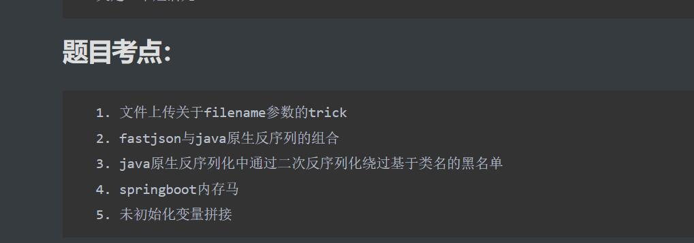

# Reverse

## baby_xor

iPlayForSG想用这个大水题当做 TSCTF-J 2022 的人口普查器。 🥤

## byte_code

EPsilon 好不容易拿到了iPlayForSG的机密文件，但是他发现自己根本看不懂，你能帮帮他吗？ 🥤

## baby_upx

iPlayForSG 的程序只要被拖进 ida 就被看光光了，于是他把自己的程序保护了起来。 🥤

Hint 1:

OEP的位置如图所示


[参考blog](https://www.52pojie.cn/thread-1534675-1-1.html)

Hint2:

后续的MD5只是校验flag是否输入正确，有关解密flag的逻辑全在主函数

## baby_key

EPsilon 说这是真签到题，但前提是得输对密码哦 🥤

## ez_maze

Hint1:

如果不能反混淆就大胆猜测这个题在干什么吧

## Link_Game

Hint1:

iPlayForSG 刚刚更新了他的连连看最高成绩，你能超过他吗？ 🥤

## Thunder_air

EPsilon 最喜欢玩雷霆空战了，只是这个游戏为什么打不开呢？ 🥤

## upx_revenge

Jameshoi 看 iPlayForSG 的 baby_upx 已经被干爆了，于是打算帮他报仇。 🥤

## 🤖

空白爷看到TSCTF-J的rev方向已经被打烂了，友情提供一道船新逆向题。 题目描述：stupid 🤖

# Web

## 词超人

I thimk I ned to incraese my vocabuilary.

( 所有答案正确后提交就能得到flag哦 ，一血找bridge要奶茶！)

http://49.232.201.163:46128/

## 真真历险记

来自李唐国的DZ在离开家乡冉日喀前往水卢国运送*flag*的路上, 因为疏忽大意弄丢了自己心爱的坐骑小马珠珠, 你能帮他找一下他的马吗?
ps：建议佩戴耳机享受美妙音乐😇

101.201.48.155:8081

Hint:

建议关注颜色

## OnlyIMG

PHP is not allowed here ！

http://39.107.138.71:8080/

（题目环境每个小时重置一次）

Hint:

1. Format String may help you find the secret path .
2. PHP version 7.4.27

## 寒秋送温暖

你是否因为做题没有头绪而心生困扰、内心冰冷呢？ 来看看这道ez的文件上传题，无需高超bypass，不用玄妙对脑电波，给你带来温暖

🥤 http://120.53.241.93:10086/

题目环境每30min重置一次

## can can need picture

做题做累了，就来看看二刺猿。 （一血奖励是出题人请吃饭哦） 题目环境：[8.141.150.150:11233](http://8.141.150.150:11233/)

## 百里香之叶

简单的模板注入，中英日三语特供版，

Flag in /flag

http://39.107.138.71:8090/

（题目环境每个小时重置一次）

## 你的名字

WOW.....你在匿名提问箱里被表白了？聪明的你能想办法找到提问者的名字吗？

（请务必阅读附件 readme.pdf，前三血找bridge要奶茶！）

题目环境：（二选一）

http://39.105.119.124:43111/

http://49.232.201.163:43111/ （服务器绷不住了）

hint1:

关于文档里提供的 webhook 网站，刚刚测试了一下，目前 https://webhook.site/ 可以使用，记得将网站提供的url中的https协议换成http

最近几天由于特殊原因，网站极其不稳定，可以多发几个包

（当然有vps的同学直接监听即可）

hint2:

再提供一个xss平台作为辅助，如果卡住了可以多和出题人交流一下进度 https://xss.pt/

hint3:

有没有办法结合两个注入点完成xss？

## Url Shorten Server

Enjoy shortening your url links and finding something in database! 

🥤

(PS: 后端30min刷新，由于出题人太懒了，遇见前端问题就手动刷新下浏览器缓存QwQ)

Addr: http://121.4.73.103:3001/

Hint:

想要 access 吗？翻翻 serde-rs 的 issue 有惊喜！

## ezja

一道很烂的java题，快来试试吧 ：]

 [http://123.57.193.197:8082](http://123.57.193.197:8082/)

22的同学做出来可以每天找bridge要奶茶

Hint:



# Pwnable

## checkin

step1: Read the source code of pwn.c 

step2: Connect to our server using nc ( nc xxx.xxx.xxx.xxx(ip) xxxx(port) ) 

step3: Enter some values to make the program run the backdoor() func

 step4: system("/bin/sh") can give u a shell , and u can use 'cat flag' to get flagWhere to download and how to use nc? https://www.bing.com/ https://www.google.com/ https://www.baidu.com/What is stack overflow (栈溢出)? https://www.bing.com/ https://www.google.com/ https://www.baidu.com/ But In this challenge, just TRY and OBSERVE the output to get the flagGL&HF ！`10.21.162.184:6661`

## ヰ世界転生

因为神様出错而导致 Nova 在校园里被菜鸟驿站无人车创死，面对女神给出的条件，他的选择是...

`10.21.162.184:6657`

## ret2shellcode

```
10.21.162.184:6660
```

## ASCII_ART

很好看的字符画，你觉得呢？`10.21.162.184:6658`

## Another_Checkin_Pwn

输入一个字符串就能获取 shell，但是粗心的 Nova 把附件弄丢了 qwq

P.S 不要开多个连接，否则容器会 shutdown。

`10.21.224.111:4090`

## Easy shellcode

ubuntu20

`64.27.6.187:9999`

## large apple

多骚扰出题人`121.4.73.103:10500`

## GoAndWriteOnHisThigh

你和 Nova, ibukifalling, dian_zhang, silentE, bridge 关在了一起，拥有笔的你能做些什么呢？

Hint1: Golang 的变量有些时候保存在栈上，有些时候保存在堆上，好怪哦，好想让它保存在栈上，这样就简单多了 qwq

Hint2: 大家都喜欢在 F0 大腿上写字，因为 F0 的腿白白的，香香的

Hint3: 要是在腿上写很长很长的字符串的话， 他们一定会被玩坏的吧。但如果在**敏感部位**做一些特殊操作的话是不是就不会玩坏了，还能让他们随你使用，很棒吧

Hint4: Golang 的返回地址居然靠的是 *add rsp, xxxh;* *retn*

`10.21.162.184:6623`

# Crypto

## T0ni's_RSA

另外两个大学霸出的题目太难了，所以做做T0ni小菜鸡的题目吧。 （flag是一句至理名言）

## Nonograms

密码签到题，一款填字游戏，祝君好运！(flag包含了Chaoyue对各位选手的真挚祝福)提交格式：TSCTF-J{flag}

Hint: 画图 ——> 颜色填充工具

## Two Keys

Chaoyue手上有两个密钥，一个叫做key，另一个也叫做KEY。提交格式：TSCTF-J{flag}

hint1: Do you know Catalan Number?

hint2: Do you know hashcat？

## 锟斤拷烫烫烫

### 364

手持两把锟斤拷，口中疾呼烫烫烫。Chaoyue在编程时经常遇到“锟斤拷烫烫烫”，这是怎么回事呢？提交格式：TSCTF-J{flag}（flag均为小写字母）

hint1: 永不消逝的电波

## Padding

Can you recover it? 🥤

## Mathematics

Mathematics is interesting!

## T0ni's_encode

又一道简单的题目，有时候暴力可以解决一些问题

## TSLCG

一条大河波浪宽~

## L1nearAlgebra

Have you learnt matrix operation?

## Padding_Revenge

Oh! Where is my padding?

# Misc

## 北邮人之声

快来听，北邮人的声音提交格式：TSCTF-J{flag}（flag均为大写字母）

## Just_Play

别的题要是做累了就来玩玩游戏吧

链接：https://pan.baidu.com/s/1Pi7WC8vew7dhf_c2n4RH0A 

提取码：Nova

解压密码:

WelcomeToTSCTFJ2022

## strange base64

### 388

这里有很多好玩的中文

[题目](https://pastebin.com/GrLXWCa1)

nc 121.4.73.103 10007

## Black Tea

明天是Merak的组内聚会，Nova和店長作为组内最抽象的两个人正在商量坏事。 店長：“明天桥桥会准备64杯茶，其中63杯是正常的乌龙茶，还有一杯是红茶（致死量），到时候是你递茶，你要把那杯红茶递给SilentE。” “因为有桥桥看着，我不能动太大的手脚或有太明显的暗示，不过我已经想了一个好办法” “桥桥把茶准备好后，杯柄会随机向左或向右，我会偷偷旋转其中一个茶杯180°，来告知你红茶的位置” “我已经研究过了，只要旋转一个杯子就能表示红茶的位置，原理是balabalabala...” 然而Nova当时正在欣赏百合番，并没有听店長的原理解释。 现在，64杯茶来到了Nova眼前，你能帮他找出那杯红茶吗？

 nc 120.53.107.60 9999

## Easy Kali 取证

memory在调查自己之前的windows里遗漏的关键信息，但他忘记了密码，只记得数据库内有一些关键信息，请你帮他找到那个flag

https://drive.novanoir.moe/TSCTF-J_2022/kali.zip

压缩包密码 ：swelling-aged-brahma-ignoble

https://www.layerstack.com/resources/tutorials/Resetting-root-password-for-Linux-Cloud-Servers-by-booting-into-Single-User-Mode 忘记密码怎么办呢

# Abstract

略